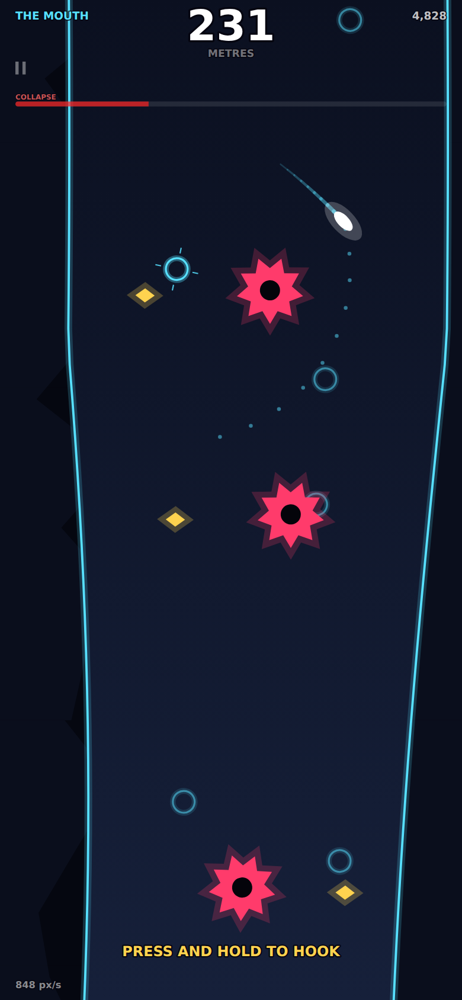

# HOOKFALL

**Know when to let go.** You dive head-first down a collapsing chasm, and your only control is a grappling hook. Hold to swing, release to fly. Runs completely offline in a browser, installs to your home screen, no ads, no accounts, no build step.

<p align="center">
  
  
  
</p>

## Play it

A static site — any web server works:

```bash
python3 -m http.server 8000     # then open http://localhost:8000
```

Open it once with a connection and the service worker caches the whole game; after that it launches from the home screen with the radio off. On iOS: Safari → Share → **Add to Home Screen**, then launch it once online. HTTPS is required for the service worker, so a bare LAN IP will let you play but not install.

**Controls — one thumb, portrait:**

| Gesture | Action |
| --- | --- |
| **Press anywhere** | Fire the hook at the highlighted anchor. It aims for you; the dotted arc shows the swing you'll get *before* you commit. |
| **Hold** | Stay on the rope. The pendulum is exact. |
| **Release** | Detach with all your momentum. Let go before the bottom of the arc to fly down-and-out; at the bottom to go sideways. |
| **Slide the same thumb up** | Reel in. Conserves angular momentum, so a reel at the bottom of an arc is a real speed pump. Optional — the game never requires it. |

## The loop

You are always falling. Gravity keeps giving you momentum and **the Collapse** — a grinding wall descending from above, faster every second — keeps taking away your margin, so stopping is death and slow is death. Hazards block the straight-down line, so you have to steer, and the rope is the only steering there is.

Every swing is a trade: the rope buys lateral control but converts downward speed into sideways speed, and the Collapse is eating the gap you just bought. Skimming a hazard at speed is a **graze**; grazes chain into a multiplier that scores your descent, so the best line is also the closest one. The shaft transforms every 2,500m into a named biome — THE MOUTH, THE VEIN, SALT, THE HUM, BLACK GLASS — and you physically fly past a banner marking your own previous best.

## Why it is built this way

**Everything is procedural.** Every shape is a Canvas 2D path, every sound is WebAudio synthesis, and even the app icons are rendered by a script (`tools/make-icons.mjs`). No asset pipeline, nothing to break.

**The chasm is a pure function of depth.** Walls are closed-form; contents are generated per 900px chunk from a seeded RNG keyed by chunk index. Nothing depends on what happened above, so chunks are dropped the moment they leave the camera and regenerate identically. That's what makes the daily seed meaningful with zero network.

**Swept collision, always.** The diver covers up to 20px per 1/120s substep; point-sampling would pass straight through a saw tooth. Every hazard test is a swept segment against the hazard's moving shape.

**`shadowBlur` is never used.** It is the fastest way to lose 60fps in Canvas 2D. Glow is two draws — wide and translucent, then solid. Full-screen gradients are cached and quantised; rebuilding them per frame cost ~16ms a frame and was caught by the harness.

**Walls are survivable, hazards are not.** A 400px shaft taken at speed gives well under a second of reaction time; making the walls lethal *as well* turns the game into memorisation. A wall costs you most of your speed instead, and the Collapse does the punishing.

**A pointercancel never releases the rope.** A notification banner mid-swing must not drop you into a saw.

## Verifying it

```bash
node tools/playtest.mjs      # 17 checks in a mobile-emulated Chromium
node tools/balance.mjs       # headless dive sweep + determinism fingerprint
node tools/shots.mjs         # screenshots of every screen
```

`playtest.mjs` boots the real game on an emulated iPhone and asserts what actually breaks on phones: no console errors, no page scroll or pull-to-refresh, `touch-action: none`, a 60fps frame budget, a dive that starts/scores/ends, progress persisting, an installable manifest, a 320px screen, that one tap can never activate two settings rows — and the load-bearing one, **that it still loads and plays with the network cut off**. All 17 pass.

`balance.mjs` exploits the fact that `src/game/run.js` has no canvas, DOM or audio dependency: the whole simulation runs headless in Node at thousands of times real time. It fingerprints two runs of the same seed (the daily is worthless if the sim drifts) and flies bots with different release timing.

### Known open: the dive is too short

**The design target is a 60–180 second dive. The bots manage about six seconds, and I could not close that gap headlessly.** The harness reports this as a failing gate rather than a number moved to something it happens to hit.

What I *can* show is that the shaft itself is fair. A separate probe measured the widest passable lane at every depth: mean **424–494px** clear against a 22px diver, narrowest ever **76px**, and **zero** impassable slices across 6 seeds and 40,000px of depth. So the level generation is navigable.

What I could not verify is the *feel* — specifically the rope's steering authority against the fall speed. Measured, one second of swinging buys roughly 120px of lateral movement in a ~500px-wide shaft. That is probably too little, and it is the number to tune first. The relevant knobs, all in `src/game/config.js`:

- `PHYS.gravity` / `dragFree` — the reaction-time budget. Already cut from 2600/2550 px/s to 1150, which roughly doubled dive length.
- `PHYS.ropeMax` — shorter ropes swing faster, so authority per second goes up.
- `PHYS.swingConvert` — how much of the velocity a taut rope would destroy is fed back as tangential motion. Physically loose, but it is the difference between a rope and an anchor.
- `COLLAPSE.baseSpeed` / `accel` — how hard the wall above pushes.

My bots steer for the widest lane ahead but do not *plan a swing*, which is the actual skill, so their depth is a lower bound rather than a measurement. Half an hour of playing this by hand would tell you more than another day of my tuning it blind.

## Layout

```
index.html  styles.css  sw.js  manifest.webmanifest
src/
  main.js              bootstrap: canvas, loop, lifecycle, audio unlock
  core/                loop · input · audio · storage · fx · draw · widgets · rng
  game/
    config.js          every tunable number, physics and biomes
    world.js           procedural chasm: chunks, hazards, anchors, collision
    run.js             the dive — no canvas, no DOM, no audio
    render.js          parallax, walls, hazards, rope, diver, camera
    hud.js  screens.js  meta.js  game.js
tools/                 playtest · balance · shots · icon generation
```

A previous game, FLASHOVER (a one-thumb bullet-hell built on the same engine), lives in this repo's history at tag-worthy commit `21b1a93` if you want it back.

---

Built with [Claude Code](https://claude.com/claude-code).
