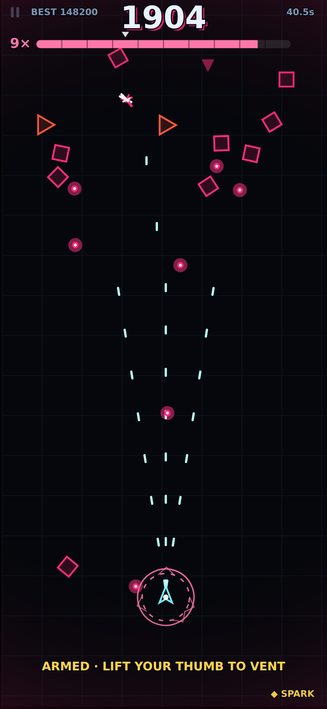
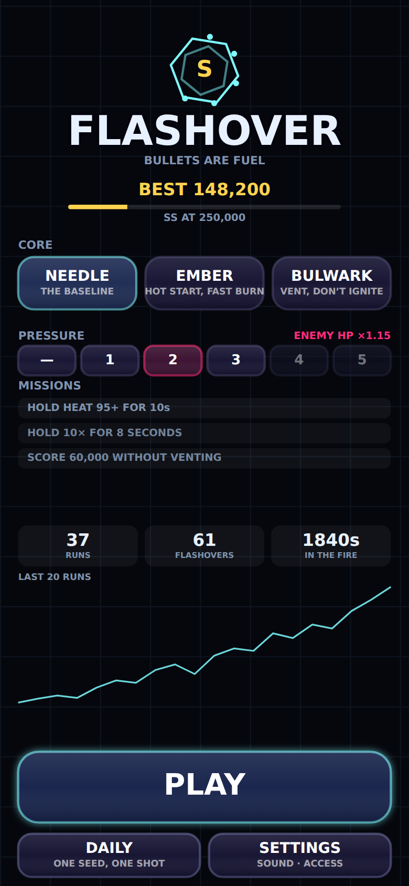
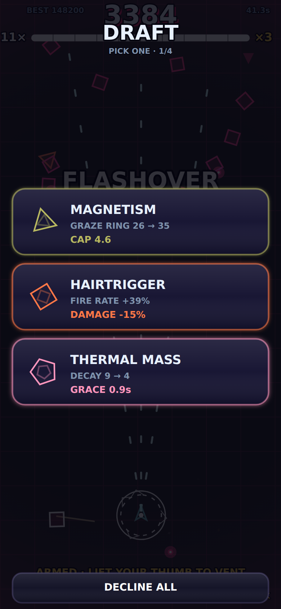

# FLASHOVER

**Bullets are fuel.** A one-thumb arcade bullet-hell that runs completely offline in a browser, installs to your home screen, and fits in a coat pocket. No ads, no accounts, no network calls, no build step.

> Hug enemy fire to build **HEAT**. Heat is your multiplier, your fire rate, your damage and your shot count — all at once. At 35 the vent arms and you can cash out for a screen-clearing payout. At 100 you **ignite**. Every eight seconds the game asks you the same question: bank it, or push?

<p align="center">
  
  
  
</p>

## Play it

It is a static site. Any web server works:

```bash
python3 -m http.server 8000     # then open http://localhost:8000 on your phone
```

Open it once with a connection and the service worker caches the whole game. After that it launches from the home screen with the radio off, on a plane, in a tunnel.

**Controls — one thumb, portrait, anywhere on the glass:**

| Gesture | Action |
| --- | --- |
| **Drag** | Fly. Relative drag, so you can hold the phone however you like and re-grip whenever you want. |
| **Lift your thumb** (at HEAT ≥ 35) | **VENT** — a shockwave that converts every bullet it touches into score and knocks enemies back. |
| **Tap the ⏸ (top-left)** | Pause |

Prefer not to vent by lifting? **Settings → VENT → tap a second finger.** A lift then never vents at all.

## The loop

- **Grazing is the whole game.** Any hostile inside your ring feeds you, weighted by how close it is. Four sources at once is the cap, so threading between two packs pays far more than parking in one cloud — and hugging the *same* thing decays to 35% after about a second, so you have to keep moving.
- **Heat drives everything at once.** Multiplier `1 + floor(heat/10)`, fire interval 125ms → 70ms, damage ×1 → ×3, and extra shots at 40 and 75. One gauge, seven readouts.
- **The vent is a choice, not a button.** It pays out and grants invulnerability, but it costs 45% of your heat — and heat is the run.
- **FLASHOVER at 100.** Four seconds of chain lightning and triple score. Ending at 35 means the next one is always in reach.
- **SECOND SPARK**, once per run, saves you from a lethal hit — but *only* above heat 85. The safety net exists exactly where the game wants you to live.
- **Four drafts per run**, three cards from twelve, never repeating. 495 loadouts before ordering.

## Why it is built this way

Nothing here is incidental, and a few decisions are worth calling out:

**Everything is procedural.** Every shape is drawn with Canvas 2D paths; every sound is synthesized with WebAudio; even the app icons are rendered by a script (`tools/make-icons.mjs`) rather than checked in as art nobody can edit. The whole game is a few hundred KB and there is no asset pipeline to break.

**A fixed 360-wide logical space.** Every number in `src/game/config.js` is tuned once and is correct on every phone; `game.js` scales that space to the device and reads the notch insets out of CSS.

**Swept collision, always.** A 3px hitbox against 420px/s projectiles at a 1/120s timestep tunnels straight through if you point-sample. Every lethal and graze test is a closest-approach-over-the-substep test instead.

**`shadowBlur` is never used.** It is the fastest way to lose 60fps in Canvas 2D. Glow is additive over-draws, and whatever the glow pass does, **every hostile projectile's opaque white core is redrawn on top of it** — the thing that kills you is never hidden by decoration.

**A pointercancel never vents.** A notification banner or a palm touch fires `pointercancel`, and a game that reads that as "the player lifted their thumb" steals runs from people. Cancels are tracked separately from releases, a vent needs a deliberate 150ms hold, and lifting by accident grants invulnerability rather than punishment.

**It must be playable in silence.** The gauge, the ring, the palette and the vignette carry 100% of the heat information. Sound is reward, never information. High contrast, reduce glow, and a screenshake *scalar* (not a toggle — nausea is not binary) all ship on day one. Reduce glow also flattens the ignition wash: a full-viewport luminance strobe at ~4Hz is exactly the kind of effect that needs an off switch, and it was the one thing in the game that no accessibility control reached until a review pass caught it.

**The daily is the same run for everyone.** That sounds obvious and it wasn't: the new-player density assist and the first-run mercy revive both keyed off the local save, so a player who installed the game five minutes ago got a materially easier daily than a veteran — and both scores landed in the same history. Both are now exempted on the daily, and `tools/balance.mjs` fingerprints it.

## Verifying it

Two harnesses, both dependency-free apart from a global Playwright:

```bash
node tools/playtest.mjs --shots   # 15 checks in a mobile-emulated Chromium
node tools/balance.mjs            # headless simulation sweep, bots at three skill levels
node tools/shots.mjs              # screenshots of every screen
```

`playtest.mjs` boots the real game on an emulated iPhone and asserts the things that actually break on phones: no console errors, no page scroll or pull-to-refresh, `touch-action: none`, a 60fps frame budget, a run that starts/scores/ends, progress persisting to `localStorage`, an installable manifest, a 320px-wide screen, and — the load-bearing one — **that the game still loads and plays with the network cut off.**

`balance.mjs` is the more unusual one. `src/game/run.js` deliberately has no canvas, DOM or audio dependency, so the entire simulation runs headless in Node at thousands of times real time. Lookahead bots play four ways — a nervous first-timer, a *banker* who cashes out with the vent, a *pusher* who rides the meter to ignition, and an expert who lives in the danger band — and the harness reports the design's own tuning gates:

```
profile      survival(s)        score      flash/run   gap(s)   %>85   %>50   vents
novice        92.9 (63-156)        39,531         1.0     33.3    9.8   38.9    11.0
competent    141.5 (25-180)       215,600         0.0     59.9    7.3   53.9     5.0
pusher       180.0 (25-180)       387,782         6.0     29.4   23.8   57.6     0.0
expert        38.7 (13-180)         6,184         0.0     31.7    9.8   29.6     0.0

PASS  pusher: one flashover every 22-30s             29.4s
PASS  pusher: 18-28% of run above heat 85            23.8%
PASS  competent: survives past the first boss (75s)  141.5s
PASS  pushing outscores banking                      387,782 vs 215,600
PASS  a first-run player gets a taste, not mastery   1.0 flashovers, 9.8% above heat 85
PASS  engaging outscores hiding by 3x or more        387,782 vs 39,531
PASS  no dead mutator (all >= 0.75x baseline)        min 0.93x
PASS  no auto-pick mutator (all <= 2.2x baseline)    max 1.85x
```

That is how the numbers in `config.js` were actually set, and it caught four problems that playing by hand would have taken a very long time to notice:

- **KINDLING** at +5 heat per kill measured a **9.7×** score swing — with auto-fire the gun became an infinite heat source and every other card became noise. Now +2.
- **TRACER** measured **0.14×** baseline. The cause turned out to be structural rather than numeric: the gun auto-aims, so homing has no upside — it only kills your fuel faster, and the enemies *are* the fuel. Softening it only got it to 0.46×. It now pays heat directly for every hit, which is what a tracer round should do, and sits at 1.00×.
- **Cheap vents were a farm.** A bot that never ignited once scored 124k by cycling vents straight off the 35 gate — a safe strategy that never engages with the danger band at all. A vent now pays in proportion to the heat it spends, so venting at 100 is worth ~2.4× per bullet what venting at the gate is.
- **The risk/reward curve has a cliff.** Playing too tight dies in seconds; playing too safe never ignites at all. Finding the viable band is what set the graze radius and decay rate.

The most useful thing it measures is that the game's central dilemma resolves the right way: **pushing to ignition outscores banking with the vent, 388k to 216k** — but banking survives longer. Both are real strategies, which is the whole point.

An adversarial review pass over the same code found the single worst bug in the project, which no amount of balance tuning would have surfaced: each enemy archetype's solo debut was gated on the field being empty, and a busy field is the normal state after about fifteen seconds. Verified across six full 180-second runs, **only DRIFTER ever spawned** — SPINNER, LANCER and BLOOM were dead code, and the spawn weighting that favoured un-introduced types meant most director ticks picked one, bailed, and spawned nothing at all. Every number above was measured against a game with one enemy in it.

## Layout

```
index.html  styles.css  sw.js  manifest.webmanifest
src/
  main.js              bootstrap: canvas, loop, lifecycle, audio unlock
  core/
    loop.js            fixed 1/120s timestep, hitstop, slow-mo, DPR-capped fit
    input.js           pointer abstraction, cancel handling, haptics
    audio.js           synthesized SFX + a generative score that tracks heat
    storage.js         localStorage with an in-memory fallback that never throws
    fx.js              pooled particles, trauma-model shake, rings, floaters
    draw.js            canvas helpers, easing, colour
    widgets.js         immediate-mode canvas UI (44px minimum touch targets)
    rng.js             seedable mulberry32, so a daily is reproducible offline
  game/
    config.js          every tunable number in the game
    entities.js        pools + swept collision
    run.js             the simulation — no canvas, no DOM, no audio
    render.js          world rendering
    hud.js             in-run HUD
    screens.js         title / settings / draft / results / pause
    meta.js            records, unlocks, marks, missions, daily seed, coaching
    game.js            state machine, logical-space transform, events → juice
tools/                 playtest, balance, screenshots, icon generation
```

## Progression

Three **cores** (NEEDLE, then EMBER at 25k and BULWARK at 90s survived), five stacking **pressure tiers** per core, eight **marks**, a rotating set of three **missions**, a rank ladder from D to SSS, and a **daily seed** derived from the date — the honest offline substitute for a leaderboard, identical for everyone, with zero network.

The results screen ends on one generated sentence about the run you just had: *"YOU SPENT 30s BELOW HEAT 30 — GET CLOSER."* Legible failure is worth more than any unlock.

---

Built with [Claude Code](https://claude.com/claude-code).
