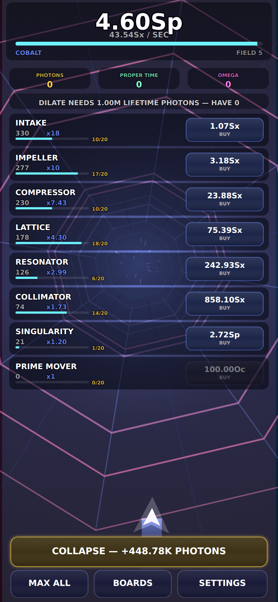
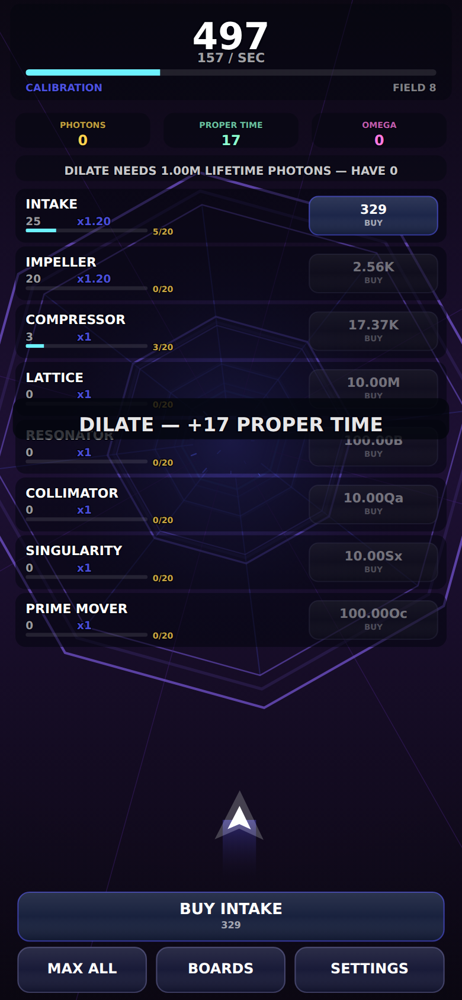
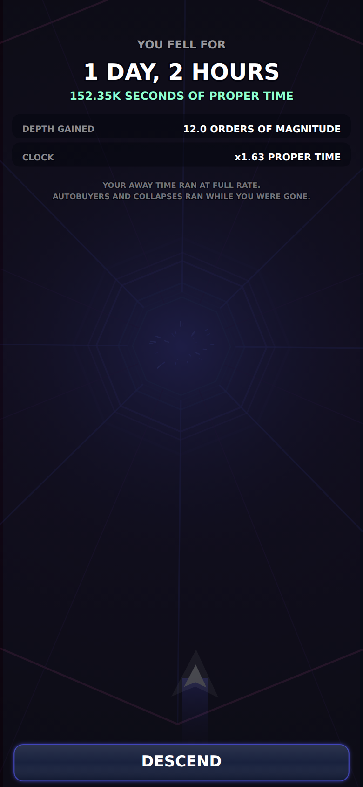

# REDSHIFT: DEEP FIELD

**You are falling down a bore that has no bottom.** Every machine you build makes the fall faster, until the picture itself can no longer keep up — and then you collapse the whole apparatus into light and fall again from deeper.

An offline-first idle game. It runs in a browser with the radio off, installs to a home screen, and keeps falling while you are gone. No ads, no accounts, no server, no build step.

<p align="center">
  
  
  
</p>

## Play it

A static site — any web server works:

```bash
python3 -m http.server 8000     # then open http://localhost:8000
```

Open it once with a connection and the service worker caches the whole game. After that it launches from the home screen with no network at all. On iOS: Safari → Share → **Add to Home Screen**, then launch it once online. HTTPS is required for the service worker, so a bare LAN IP will let you play but not install.

## The loop

**DEPTH** is the currency and the score. Eight drives make it — **INTAKE** makes depth, **IMPELLER** makes INTAKEs, **COMPRESSOR** makes IMPELLERs, and so on up the ladder. Every 20 of a drive you buy multiplies that drive's output by 1.2, forever.

When you have fallen far enough you **COLLAPSE**: the ladder is destroyed and converted into **PHOTONS**, which permanently multiply everything and buy the automation that retires the tedium — autobuyers, buy-max, a governor, and eventually an auto-collapse that runs the whole cycle while you sleep.

Enough lifetime photons and you can **DILATE**, which resets the photon layer entirely and pays **PROPER TIME**. Proper time multiplies your *clock* — the simulation runs at up to several seconds per second. Because depth grows as a high-degree polynomial in time, multiplying the clock is by far the strongest thing in the game, and it gets stronger the more drives you own.

Enough proper time and you reach the **EVENT HORIZON**, which resets everything and grants **OMEGA**. Omega is never spent, only *allocated* — and reallocated, free, whenever you like — between a longer ladder, a bigger multiplier, and a longer offline cap.

**One law: nothing automates the photon board, the tau board, or the omega allocation.** Ever. That is the decision the game never takes away, and it is why a twenty-second check-in has something in it.

## The tunnel is the readout

The whole thing is drawn as a real perspective projection down an infinite bore, and one 0..1 value — how far through the current collapse you are — widens the field of view, bows the walls, smears geometry along its own motion and Doppler-shifts red toward you and blue away. When the walls start bowing you know a reset is close without reading a word. Because it is normalised in log space, depth 1e10 looks exactly like depth 1e115.

The tunnel also gains **permanent geometry** on a monotone clock, and none of it ever goes away: dust, then ribs, then one lit **drive ring per owned tier** — thickness set by how many you own, so buying something visibly thickens a ring coming at you out of the dark — then solid walls, an accretion arc, a horizon ring, the far end of the bore folded back through itself, escort craft, a second counter-rotating bore. Come back after a week and the tunnel is unrecognisable *before* you read a single number.

And the warp floor rises permanently, so a veteran's calmest frame is faster than a beginner's fastest. A collapse never reads as a demotion.

## Why it is built this way

**The economy is one closed-form integral.** The ladder is strictly triangular — tier k drives tier k-1 and nothing drives the top — so the system is nilpotent and its exact solution is a *finite* Taylor polynomial with no truncation error at any t. The same function runs with `t = 1/20` during play and `t = 60` per chunk while you were gone. That is why offline progress is honest rather than approximated, and the harness asserts it: one evaluation of 36 hours matches 129,600 one-second steps to a relative error of 1.4e-15.

**Numbers are `{mantissa, exponent}` pairs, not floats.** Float64 dies at 1e308, which this curve reaches well before the interesting part, and everything past it is `Infinity` — which poisons every comparison downstream and formats as a permanent placeholder. A Big is a bare pair with free functions rather than methods, so it serialises straight into the save with no revive step. Every persisted Big is a *string*: `JSON.stringify(Infinity)` is `null`, and one null merged over a default silently breaks a save forever.

**"How many can I afford" is solved in logs.** Buying n units at geometric cost is a geometric series, and inverting it closed-form means the answer costs the same whether it is 3 or 3 billion.

**Offline time does not trust the device clock.** Without a server you cannot distinguish "eight hours passed" from "the user moved the clock", and pretending otherwise is theatre. What *is* guaranteed: credit is measured from a **high-water mark**, so winding the clock back and forward again crosses ground already paid for and earns exactly nothing; a refilling budget bucket bounds the rate; and every forward-travelled second is paid for once, at the same exchange rate an honest player gets. All four properties are gates in the harness.

**No cost-reduction upgrade exists, deliberately.** The ladder feeds back into itself with gain `g = (log10(1.2)/20) · Σ 1/log10(r_k)`, and depth then grows as `t^(S/(1-g))`. If `g` reaches 1 the economy diverges in finite time and the game is over in an afternoon. Lowering a cost ratio *raises* `g` — a 2% cut across the board tips it over. The invariant is stated at the top of `config.js` and asserted on every harness run.

**Everything is procedural.** Every shape is a Canvas 2D path, every sound is WebAudio synthesis, and even the app icons are rendered by a script. No asset pipeline, nothing to break. `shadowBlur` is never used; glow is two draws.

## Verifying it

```bash
node tools/coretest.mjs      # 875 checks on the numeric core
node tools/balance.mjs       # 18 economy gates over a simulated 10 days
node tools/balance.mjs --days 30 --curve
node tools/playtest.mjs      # 20 checks in a mobile-emulated Chromium
node tools/shots.mjs         # screenshots of every screen
```

`economy.js` imports `core/big.js` and `core/awaytime.js` and nothing else — no canvas, no DOM, no audio — so thirty simulated days run in Node in a few minutes. The gates check that the closed form equals stepped integration, that the loop gain and prestige feedback stay under their ceilings at every ladder size, that clock tampering is bounded, that every persisted Big round-trips without becoming `null`, that the renderer's inputs are bounded by construction, that the visual clock never regresses, and that there is always something to do within fifteen minutes.

The old harness fingerprinted two runs of one seed to prove determinism. This economy has no RNG at all, so that check would have passed forever while asserting nothing — precisely when a safety net is most needed. It was replaced with gates that can actually fail, and they did:

- **The GOVERNOR bricked the save.** Straight after a collapse the bank is exactly 10, tier 1 costs exactly 10, and a 25% reserve allows only 7.5 while every tier above is astronomically out of reach. Result: depth 10, production rate zero, forever, with no error. The reserve now only applies when a more expensive tier could actually spend it.
- **The spec's own anti-tamper did not work.** It refilled the away budget from the *claimed* elapsed time — which is exactly the quantity an attacker controls. Sixty forward clock jumps extracted 2,160 hours against a 36-hour cap. The high-water mark replaced it.
- **A cold start that read as a broken app.** A new save had no drives, so the rate was zero and nothing moved until the player found the buy button. The bore now starts with one INTAKE, because the fiction says you are already falling.

And two that only a screenshot could catch: the event banner rendering illegibly on top of the drive list, and — in the reflex game this replaced — the player's own ship sliding off the bottom of the screen as the field of view widened.

## Layout

```
index.html  styles.css  sw.js  manifest.webmanifest
src/
  main.js              bootstrap: canvas, loop, lifecycle, audio unlock
  core/
    big.js             mantissa+exponent decimals past 1e308
    awaytime.js        offline accounting that does not trust the clock
    scroll.js          list scrolling that never fires the button under the finger
    loop · input · audio · storage · fx · draw · widgets · rng
  game/
    config.js          every tunable number, with the stability invariant on top
    economy.js         the whole simulation — no canvas, no DOM, no audio
    world.js           the adapter: economy -> the eight fields render.js reads
    render.js          the perspective projection and its four distortions
    layers.js          the ten permanent visual layers
    screens.js  game.js
tools/                 coretest · balance · playtest · shots · icon generation
```

Two earlier games live in this repo's history on the same engine: REDSHIFT, a one-thumb warp-tunnel reflex game, and before it HOOKFALL, a grapple-swing physics dive.

---

Built with [Claude Code](https://claude.com/claude-code).
