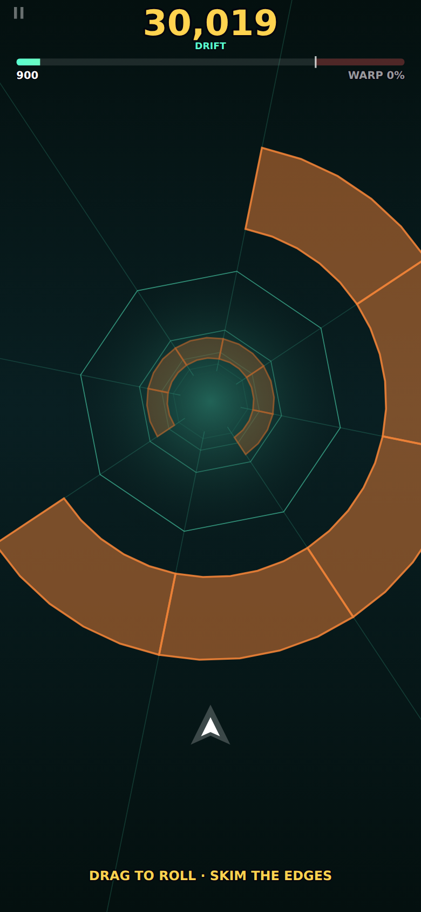
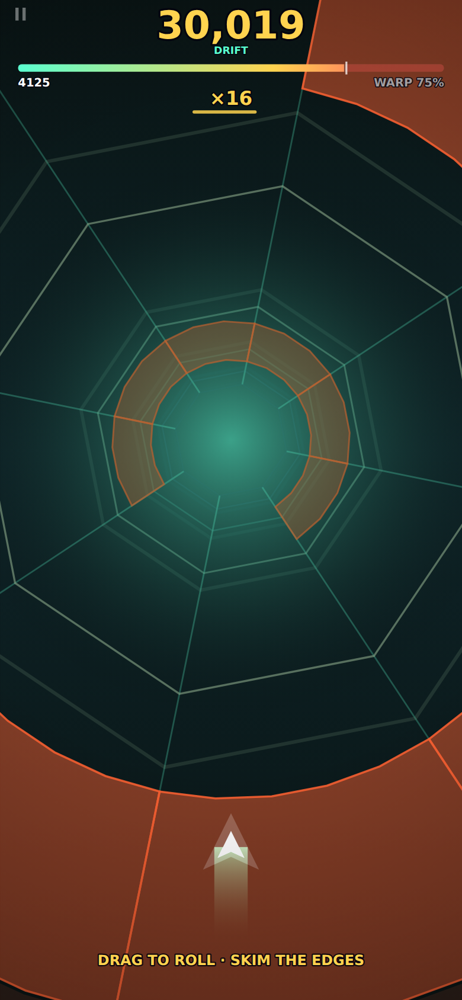
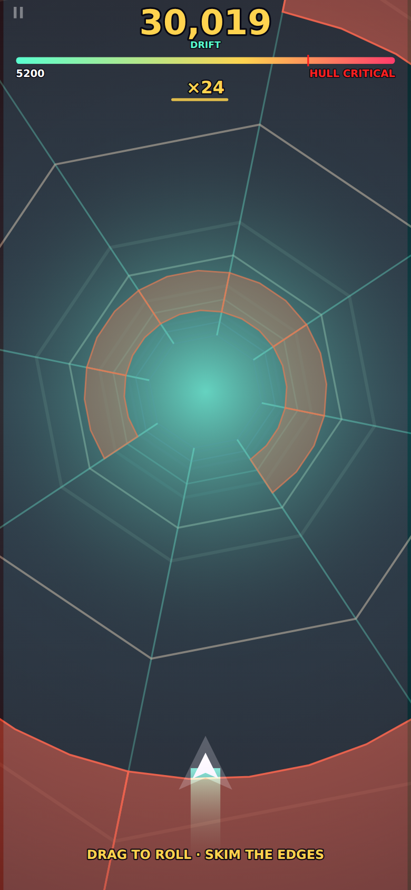

# REDSHIFT

**The faster you go, the more it lies.** You fly down a tube in real perspective, and your velocity distorts the projection: the field of view widens, the walls bow outward, geometry smears along its own motion, and colour Doppler-shifts red toward you and blue away. Speed is the score *and* the difficulty, so the distortion is the readout — and playing well is what makes the world hard to read.

Runs completely offline in a browser, installs to your home screen, no ads, no accounts, no build step.

<p align="center">
  
  
  
</p>

*Those three frames are the **same piece of tube at the same depth**, with the simulation frozen. The only thing that changes between them is speed. Everything else you can see is the distortion.*

## Play it

A static site — any web server works:

```bash
python3 -m http.server 8000     # then open http://localhost:8000
```

Open it once with a connection and the service worker caches the whole game; after that it launches from the home screen with the radio off. On iOS: Safari → Share → **Add to Home Screen**, then launch it once online. HTTPS is required for the service worker, so a bare LAN IP will let you play but not install.

**Controls — one thumb, portrait.** Drag anywhere to roll around the bore. That is the entire input. The drag is relative, so your thumb can start anywhere on the screen and re-grip whenever it runs out of room.

## The loop

The bore **pulls you**, harder the deeper you get, so your speed has a floor that rises all run. You cannot refuse to go fast, and the distortion escalates whether you like it or not.

Everything above that floor has to be earned. Crossing a plane pays a little; **shaving its edge** — passing within a hair of the wall — pays properly, chains into a multiplier, and is the only real acceleration in the game.

Then the twist that makes the whole thing hold together: your hull **tires with time**, and a near miss is the *only* thing that works the fatigue back out. Flying close to the wall is simultaneously what makes you fast and what keeps you alive. Playing safe is a slow bleed toward a hull that can no longer take the speed the bore is dragging you to.

Clipping a wall is survivable while you are slow and the picture is honest. Past your **shatter point** — the moving mark on the speed bar — it is not. So the endgame is a genuine dilemma: the faster you go the more the view lies, and the less you can afford to misread it.

Five zones (CALIBRATION · DRIFT · CASCADE · REDSHIFT · EVENT HORIZON) each bring a palette and a new obstacle pattern.

## Why it is built this way

**The renderer lies; the simulation never does.** Every obstacle is a set of *blocked angular arcs*, and collision is "is my angle inside one as I cross its z". That is exact, cheap, and completely independent of however hard the projection is bending the picture. The view can distort without limit and the game underneath stays honest.

**Obstacle spacing is measured in seconds, not units.** The bore pulls you from 900 to over 4,600 units/sec across a run. A fixed unit spacing would quietly turn into an unreadable strobe, so the generator scales spacing by the speed the floor implies at that depth. Escalating speed shows up as spectacle, not as an unfair difficulty curve.

**Openings walk; they don't teleport.** At this spacing the ship can turn about 3 rad between planes, and the bore is only 3.14 rad from side to side — so a uniformly random opening is sometimes *physically out of reach*. That isn't difficulty, it's a coin flip. Each opening is placed within a few sectors of the last, and the first plane of every chunk is a wide three-sector mouth because the chunk seam is the one place the generator can't see what came before.

**The ship's screen position is fixed.** It is drawn through the same distorting projection as everything else — it banks and bows with the world — but its world radius is divided back out by the focal length. Without that, the widening field of view slides your own craft off the bottom of the display exactly when you most need to see it.

**Everything is procedural.** Every shape is a Canvas 2D path, every sound is WebAudio synthesis, and even the app icons are rendered by a script (`tools/make-icons.mjs`). No asset pipeline, nothing to break.

**The track is a pure function of (seed, z).** Chunks are generated from a seeded RNG keyed by chunk index, so they're dropped the moment they pass the camera and regenerate identically. That's what makes the daily seed meaningful with zero network.

**`shadowBlur` is never used.** It is the fastest way to lose 60fps in Canvas 2D. Glow is two draws — wide and translucent, then solid. Full-screen gradients are cached and quantised.

## Verifying it

```bash
node tools/playtest.mjs      # 17 checks in a mobile-emulated Chromium
node tools/balance.mjs       # flight sweep + determinism fingerprint
node tools/balance.mjs --curve   # speed/warp vs distance for one pilot
node tools/shots.mjs        # screenshots of every screen
```

`playtest.mjs` boots the real game on an emulated iPhone and asserts what actually breaks on phones: no console errors, no page scroll or pull-to-refresh, `touch-action: none`, a 60fps frame budget, a run that starts/scores/ends, progress persisting, an installable manifest, a 320px screen, that one tap can never activate two settings rows — and the load-bearing one, **that it still loads and plays with the network cut off**. All 17 pass.

`balance.mjs` exploits the fact that `src/game/run.js` has no canvas, DOM or audio dependency: the whole simulation runs headless in Node at thousands of times real time. It flies four pilots that differ only in how close to the wall they choose to fly, which is the entire skill of the game, and drives them through the *real* steering path — drag anchor, turn-rate clamp and all — so what it measures is what a thumb can actually do.

Its most important output is the warp curve, because if velocity doesn't visibly escalate there is no game:

```
  dist     speed   warp   fov     zone            clips
       7     898    0%    620   CALIBRATION       0  ························
   20005    1943   24%    756   CALIBRATION       1  ██████··················
   40017    3410   58%    947   DRIFT             2  ██████████████··········
   80014    3566   62%    967   CASCADE           7  ███████████████·········
  120008    5173   99%   1176   CASCADE          10  ████████████████████████
  ended: shattered at 126225 — peak warp 100%
```

The ten gates check that the distortion actually happens, that a calm run stays legible early, that grazing is what buys speed, that greed is punished as well as rewarded, that flying fast beats playing safe on *both* distance and score, that doing nothing gets you nowhere, and that nobody flies forever. All ten pass.

The gates are also what found the real bugs. Two worth naming:

- **The control had a degenerate line.** A bot that never steered was reaching 100% warp with eighteen grazes and one clip. Arcs are centred at `i·step + step/2`, so angle 0 sits exactly on a sector seam and scored clearance of *precisely zero* — never a clip, always a graze. `SHIP.radius` existed in the config and had never been wired into collision, so the ship was a dimensionless point. Measuring clearance from the hull's edge killed the exploit.
- **Speed had a hidden equilibrium.** A gate bonus paid per plane crossed is worth more per second the faster you go, so gains and decay balance out at `decay × spacing / gateGain` regardless of skill — about 1,370 units/sec, or 11% warp, forever. The entire premise of the game was unreachable and no test noticed, because every test was checking that the *code* worked. Only plotting warp against distance showed the curve was flat.

## Layout

```
index.html  styles.css  sw.js  manifest.webmanifest
src/
  main.js              bootstrap: canvas, loop, lifecycle, audio unlock
  core/                loop · input · audio · storage · fx · draw · widgets · rng
  game/
    config.js          every tunable number, physics and zones
    track.js           procedural tube: chunks, patterns, blocked arcs
    run.js             the run — no canvas, no DOM, no audio
    render.js          the perspective projection and its four distortions
    hud.js  screens.js  meta.js  game.js
tools/                 playtest · balance · shots · icon generation
```

Two earlier games live in this repo's history on the same engine: HOOKFALL, a grapple-swing physics dive, and FLASHOVER, a one-thumb bullet-hell.

---

Built with [Claude Code](https://claude.com/claude-code).
